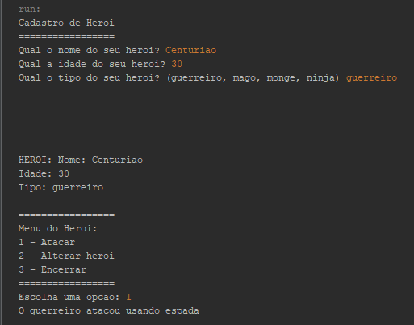

<h1 align="center">Writing Classes for a Game:</h1>

## 📖 About the project
In this project, I have developed an interactive program featuring an easy and intuitive menu. The menu consists of conditionals and loops, incorporating basic information validation. Following each input, the program automatically updates the information. <br>
I opted for the Java language for this project due to its ease of class creation. This challenge is part of the DIO 'Potência Tech iFood - Programação do Zero' bootcamp.



### 3️⃣ Writing Classes for a Game

**What should be used**

- Variables
- Operators
- Loops
- Decision Structures
- Functions
- Classes and Objects

### Objective:

Create a generic class representing a hero in an adventure with the following properties:

- `name`
- `age`
- `type` (e.g., warrior, mage, monk, ninja)

Additionally, it should have a method called `attack` that must meet the following requirements:

- Display the message: `the {type} attacked using {attack}`
- Where `{type}` should concatenate the type from the class property
- And `{attack}` should follow a different description according to the type, following the table below:

  - If mage -> in the attack, display (used magic)
  - If warrior -> in the attack, display (used sword)
  - If monk -> in the attack, display (used martial arts)
  - If ninja -> in the attack, display (used shuriken)

### Output

At the end, a message should be displayed:

- `the {type} attacked using {attack}`
  - mage attacked using magic
  - warrior attacked using sword

## 🦾 Technologies used
<div style="display: flex;">
  


</div>

## 🤔 What i learned
- Basically, I just improved my skills in something I already know because this bootcamp challenge is a basic introduction to coding.

## 👽 How to clone this project

````bash
    # Select where you want to clone
    $ cd ~/Documents/WHERE_YOU_WANT
````

````bash
    # Clone the project
    $ git clone https://github.com/DevGustavus/REPOSITORY_NAME.git
````

````bash
    # Check if cloning worked fine
    $ cd ~/Documents/DIRECTORY_LOCATION
    $ ls
````
